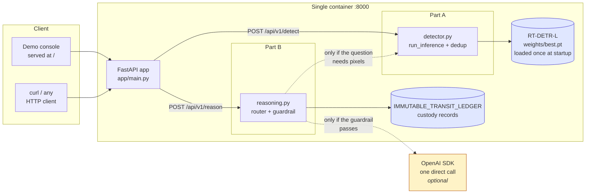
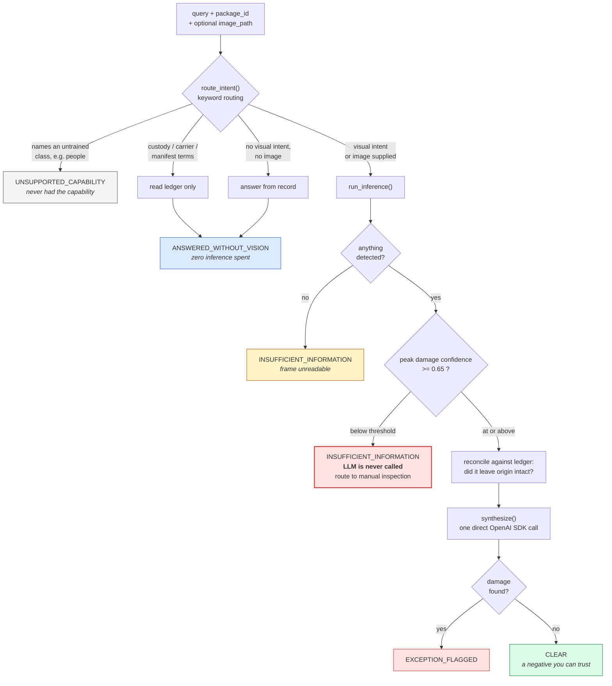
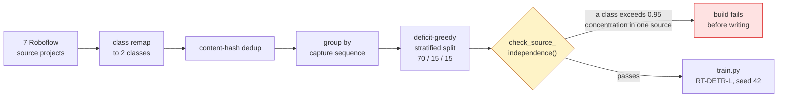
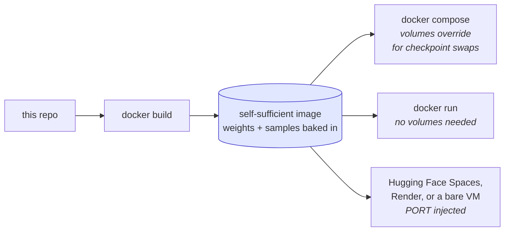

# Parcel Exception Detection &amp; Reasoning API

**A logistics damage-triage service that knows when to stay silent.**

An RT-DETR-L detector locates parcels and damage. A hand-written reasoning layer decides
whether a question needs the detector at all, reconciles what it sees against an immutable
transit ledger, and refuses to answer when the evidence is too weak to support a liability
claim.

<table>
<tr>
<td><b>Detector</b></td><td>RT-DETR-L fine-tuned, 2 non-COCO classes</td>
<td><b>Serving</b></td><td>FastAPI + Docker, CPU-only image</td>
</tr>
<tr>
<td><b>Reasoning</b></td><td>Zero agentic frameworks, plain Python</td>
<td><b>Tests</b></td><td>32, no GPU or API key required</td>
</tr>
</table>

> [!IMPORTANT]
> **Read [MEMO.md](MEMO.md) section 4 before quoting any metric.** The shipped model (v3)
> reaches **0.730 mAP50** overall and **0.625** on `damaged-package`, up from 0.436 / 0.245
> for v1 on the identical test set. Per-source recall still ranges **0.000 to 0.934**, so
> the model remains partly source-dependent. That limitation is measured, not hidden, and
> it is the reason the guardrail in Part B exists.

---

## Contents

[Constraints](#constraints-checklist) ·
[System architecture](#system-architecture) ·
[Quickstart](#quickstart) ·
[Deployment](#deployment) ·
[Endpoints](#endpoints) ·
[Evaluation](#evaluation-artefacts) ·
[Tests](#tests) ·
[Layout](#repository-layout)

---

## Constraints checklist

- [x] **No agentic frameworks.** No LangChain, LlamaIndex, CrewAI, AutoGen, Haystack, or
      Semantic Kernel anywhere. Routing, guardrails and context assembly are vanilla
      Python; the one LLM call uses the official `openai` SDK.
      Verify: `grep -rE "langchain|llama_index|crewai|autogen" app/ scripts/ tests/`
      returns only the two docstrings declaring their absence.
- [x] **RT-DETR.** `ultralytics.RTDETR` fine-tuned from `rtdetr-l.pt`. Own training code,
      no AutoML, no no-code platform.
- [x] **Non-COCO classes.** Both `package` and `damaged-package` are outside the COCO
      label set, which has backpack, handbag and suitcase but no box, package, parcel or
      carton category.
- [x] **Reproducible.** Pinned dependencies, seed 42, documented hardware, measured
      training time, and a `run_manifest.json` written beside every checkpoint. See
      [REPRODUCIBILITY.md](REPRODUCIBILITY.md).
- [x] **Standard upload.** `/api/v1/detect` takes a plain `UploadFile`.

---

## System architecture

### The whole system at a glance

One container, one process, one model object in memory. The demo console, both endpoints,
and the health probe are all served by the same FastAPI app, so `docker compose up` brings
up everything with nothing left to wire together.



The two dotted edges are the whole design argument. The detector is consulted only when the
question actually requires pixels, and the language model is consulted only after the
evidence has already cleared a numeric threshold. Neither can be reached by a question
that should have been refused.

### Part B: how a question becomes a decision

This is the part that is hand-written rather than delegated to a framework. Read it top to
bottom; the code in `reasoning.py` has the same shape.



Three properties worth checking in the code rather than taking on trust:

| Property | Where to verify |
| :--- | :--- |
| The LLM cannot repair weak detector evidence. The guardrail halt returns before `synthesize()` is reachable. | `app/reasoning.py`, and `tests/test_reasoning.py::TestGuardrail` pins both sides of 0.65 |
| A refusal requires *positive* evidence of being off-topic. An image plus an ambiguous question still gets inspected, rather than being refused by default. | `route_intent()` fallback branch |
| `UNSUPPORTED_CAPABILITY` and the vision vocabulary never overlap. | asserted as an invariant in the test suite |

### Why the guardrail is not decoration

The detector's per-source recall spans 0.000 to 0.934. A model that uneven will sometimes
produce a confident-looking box on an image style it has never handled well. The threshold
converts that from a silent wrong answer into an explicit `INSUFFICIENT_INFORMATION` and a
manual-inspection route. The honest metric and the refusal behaviour are the same design
decision viewed from two directions.

### Data pipeline

The first trained model scored 99.85% at guessing the class from the source project alone.
It had learned provenance, not damage. The pipeline below is what fixed that, and the
gate at the end is what stops it recurring.



Grouping happens **before** splitting, so near-duplicate frames from one capture sequence
cannot straddle train and test. `scripts/diagnose_shortcuts.py` measures source-only,
resolution-only and box-geometry predictability on any dataset version without needing a
model. MEMO.md section 2 carries the before/after numbers.

---

## Quickstart

### Local, with GPU

```bash
py -3.11 -m venv venv
venv\Scripts\activate              # Windows;  source venv/bin/activate elsewhere
python -m pip install --upgrade pip

pip install -r requirements-cuda.txt   # GPU (Blackwell needs CUDA 12.8). Skip for CPU.
pip install -r requirements.txt

cp .env.example .env                   # OPENAI_API_KEY optional, see below
uvicorn app.main:app --host 0.0.0.0 --port 8000
```

Model weights (`weights/best.pt`) are committed to this repository. No separate download
is required: clone, install, and the API serves the trained model immediately. They load
from `WEIGHTS_PATH`, which defaults to that path.

To retrain from scratch, follow [REPRODUCIBILITY.md](REPRODUCIBILITY.md): build the
dataset, run `python scripts/train.py`, then copy
`runs/train/rtdetr_logistics_v1/weights/best.pt` to `weights/best.pt`.

> **Without an API key** the service still runs end to end. `/reason` returns a clearly
> labelled deterministic summary instead of LLM prose, so routing and guardrail behaviour
> are fully reviewable without credentials. The status, the guardrail decision and the
> detections are computed identically either way.

### Docker

```bash
docker compose up --build
```

Then open **<http://localhost:8000/>** for the demo console, or call the API directly.

The image is self-sufficient: the serving checkpoint and the sample images are baked in,
so a bare `docker run` with no volumes works too.

```bash
docker run -p 8000:8000 logistics-exception-engine:1.0.0
```

`docker-compose.yml` additionally bind-mounts `weights/` and `sample_images/` read-only
over the same paths, which lets you swap a checkpoint locally without a rebuild.

> [!NOTE]
> **The Docker image is CPU-only by design**, so inference there runs at roughly **1.2 to
> 1.7 s** per image. The 24 ms figure quoted elsewhere is GPU steady state from
> `reports/metrics_test_split.json`. A CUDA base image would add several GB for no benefit
> to a reviewer running this on a laptop.

### Demo console

The container serves a single-page UI at `/` alongside the API. No build step, no CDN
dependencies, so it works offline.

* **Detection panel** draws bounding boxes on a canvas with class colours and confidence
  values, and exports the annotated result as a PNG.
* **Reasoning panel** shows the status as a colour-coded badge, with one preset question
  per routing branch so every path is reachable without knowing the trigger vocabulary.
* **Sample thumbnails** are captioned by the behaviour each one triggers: intact leads to
  `CLEAR`, clear damage is flagged, borderline is refused at 0.62 against the 0.65
  threshold.
* **Raw JSON** toggles on both panels, so the exact API response sits beside the visual.

The UI is convenience only. Both endpoints are fully usable without it, and it is excluded
from the OpenAPI schema at `/docs`.

---

## Deployment

The image needs no compose file, no volumes and no environment file to run, so it deploys
to any host that can build a Dockerfile. `$PORT` is read at startup and defaults to 8000,
which is what single-container platforms typically inject.



Verified on all three paths: `/health`, `/api/v1/samples`, `/samples/{name}` and
`/api/v1/detect` all serve correctly from a container started with zero volumes and zero
environment file, and again with a non-default `PORT`.

---

## Endpoints

All responses below are real output from the trained model, not illustrations.

### `GET /health`

```json
{"status":"ok","model_loaded":true,"weights_path":"weights/best.pt",
 "classes":["package","damaged-package"],"critical_classes":["damaged-package"],
 "detection_threshold":0.25,"guardrail_threshold":0.65}
```

Also surfaces both thresholds, so a reviewer can confirm the guardrail value without
reading the source. The demo console reads them from here rather than repeating them in
markup that could drift.

### `POST /api/v1/detect`

```bash
curl -X POST http://localhost:8000/api/v1/detect \
     -F "file=@sample_images/intact_parcel.jpg;type=image/jpeg"
```

```json
{
  "status": "success",
  "filename": "ambiguous_parcel.jpg",
  "image_size": [640, 640],
  "inference_time_ms": 24.8,
  "count": 1,
  "detections": [
    {"label": "damaged-package", "confidence": 0.6227, "bbox": [103.41, 3.01, 563.7, 639.5]}
  ]
}
```

Overlapping same-class boxes are de-duplicated at IoU 0.7 before the response is built.
RT-DETR is NMS-free, so duplicate decoder queries otherwise survive; suppressing them
removed 90 of 420 false positives at zero recall cost (`scripts/tune_dedup.py`).

`bbox` is `[x1, y1, x2, y2]` in absolute pixels. Errors are explicit: 415 for a
non-image content type, 400 for undecodable bytes, 413 over the size limit, 503 when no
checkpoint is loaded.

The first request after startup costs ~2.5 s for CUDA warm-up.

### `POST /api/v1/reason`

**Guardrail refusal.** A genuinely borderline parcel detected at 0.6227, just below the
0.65 threshold. The LLM is never called on this path.

```bash
curl -X POST http://localhost:8000/api/v1/reason \
  -H "Content-Type: application/json" \
  -d '{"package_id":"PKG-8821",
       "image_path":"sample_images/ambiguous_parcel.jpg",
       "query":"Is this parcel damaged enough to raise a carrier claim?"}'
```

```json
{
  "package_id": "PKG-8821",
  "status": "INSUFFICIENT_INFORMATION",
  "requires_vision_model": true,
  "guardrail_passed": false,
  "max_critical_confidence": 0.6227,
  "decision_summary": "INSUFFICIENT_INFORMATION. Defect signal present but weak: peak critical-class confidence 0.62 is below the operational threshold 0.65. Refusing to assign liability from an ambiguous detection. Routing this parcel to manual inspection rather than guessing.",
  "detections": [
    {"label": "damaged-package", "confidence": 0.6227, "bbox": [103.41, 3.01, 563.7, 639.5]}
  ],
  "ledger_record": {"carrier": "Apex Logistics", "origin_label_status": "INTACT", "...": "..."}
}
```

**Clear finding.** A parcel located confidently with no defect above threshold. Reported
as `CLEAR` rather than "insufficient", because we know the camera actually saw a parcel.

```json
{
  "package_id": "PKG-9940",
  "status": "CLEAR",
  "requires_vision_model": true,
  "guardrail_passed": true,
  "max_critical_confidence": 0.0,
  "decision_summary": "[deterministic fallback - no LLM key configured] No defect class detected. Observed objects: {'package': 1}.",
  "detections": [
    {"label": "package", "confidence": 0.967, "bbox": [350.95, 205.96, 412.55, 302.25]}
  ]
}
```

**Capability refusal.** A visual question naming something outside the trained label set.
Distinct from `INSUFFICIENT_INFORMATION`: there we looked and the evidence was weak, here
we never had the capability.

```json
{
  "package_id": "PKG-8821",
  "status": "UNSUPPORTED_CAPABILITY",
  "requires_vision_model": false,
  "guardrail_passed": false,
  "decision_summary": "Cannot answer from this model. The question asks about ['people']; the model has no person class. The detector is trained on package and damaged-package only. Answering from those classes would be a confident wrong answer, so this is routed to manual inspection instead."
}
```

**Ledger-only.** A custody question needs no pixels, so no inference is spent.
`status` is `ANSWERED_WITHOUT_VISION` and `requires_vision_model` is `false`. A question
that is simply unrelated to the parcel returns the same status, answered from the record
with the detector left untouched.

### Status values

| Status | Meaning |
| :--- | :--- |
| `EXCEPTION_FLAGGED` | damage above threshold, reconciled against the ledger |
| `CLEAR` | parcel located confidently, no defect above threshold |
| `INSUFFICIENT_INFORMATION` | evidence too weak, or frame unreadable. No LLM call |
| `UNSUPPORTED_CAPABILITY` | question is outside the trained label set |
| `ANSWERED_WITHOUT_VISION` | answered from the transit record alone |

These five are the complete set of values the API can return. `VISION_REQUIRED`,
`LEDGER_ONLY` and `OUT_OF_SCOPE` are internal router outcomes and never appear in a
response.

### Support routes

| Route | Purpose |
| :--- | :--- |
| `GET /` | demo console |
| `GET /api/v1/samples` | names of the bundled sample images, so the UI hardcodes no filenames |
| `GET /samples/{name}` | serves one bundled sample; resolves and confirms containment first, so `../` cannot escape the directory |

Both sample routes are excluded from the OpenAPI schema. They exist for the console.

---

## Evaluation artefacts

`reports/` holds the committed diagnostics so a reviewer never has to retrain to see them:

| File | What it shows |
| :--- | :--- |
| `confusion_matrix.png` | normalised confusion matrix from the training run |
| `pr_curve.png` | precision-recall curve per class |
| `training_curves.png` | loss and mAP across all 40 epochs |
| `metrics_test_split.json` | the exact numbers quoted in MEMO.md |
| `shortcuts_v1.json` / `shortcuts_v3.json` | shortcut-dependence before and after the dataset fix |
| `dedup_sweep.json` | the IoU threshold sweep behind the 0.7 choice |

Regenerate the tables, including the two analyses the brief asks for:

```bash
python scripts/evaluate.py --split test --confusion --per-source
```

`--confusion` reports class confusion, missed detections, and background false positives
separately, because aggregate mAP collapses three different failure modes into one number.
`--per-source` reports recall per source project; a wide spread means the model keyed on
source appearance rather than the visual class.

### Headline results, v1 versus v3, identical test set

| Metric | v1 | v3 shipped |
| :--- | ---: | ---: |
| overall mAP50 | 0.436 | **0.730** |
| `package` mAP50 | — | 0.834 |
| `damaged-package` mAP50 | 0.245 | **0.625** |
| `damaged-package` precision | 0.307 | **0.730** |
| false positives | 1,537 | **307** |

Test split is 939 images, held out at the capture-sequence level. MEMO.md section 4 carries
the full table and section 5 the five failure cases behind it.

---

## Tests

```bash
python -m pytest tests/ -q          # 32 tests, no GPU/checkpoint/API key needed
```

The decision layer is our own code, so it is verifiable on its own terms rather than only
observable through the model. Coverage includes every routing branch, both sides of the
0.65 boundary, the empty-frame case, detection de-duplication, and two invariants: that the
vision and unsupported vocabularies stay disjoint, and that every unsupported token has a
reason string.

Two further checks run against a live container rather than in-process:

```bash
python scripts/smoke_test_docker.py    # 6-step end-to-end Docker verification
python scripts/audit_submission.py     # adversarial self-audit against the brief
```

---

## Repository layout

```text
app/
  main.py          endpoints, ledger, sample routes, latency logging
  detector.py      model load, inference, class-aware IoU de-duplication
  reasoning.py     intent router, guardrail, ledger reconciliation, LLM call
  schemas.py       pydantic request/response contracts
  static/          demo console, single file, no build step

scripts/
  prepare_dataset.py    source download, remap, dedup, group split, skew gate
  train.py              RT-DETR-L fine-tune, seed 42, anti-shortcut augmentation
  evaluate.py           mAP, confusion behaviour, per-source recall
  diagnose_shortcuts.py source/resolution/geometry predictability, no model needed
  tune_dedup.py         IoU threshold sweep over cached predictions
  audit_submission.py   adversarial self-audit against the brief
  smoke_test_docker.py  6-step end-to-end container test, stdlib only

tests/            test_reasoning.py, 32 tests
weights/          best.pt, the shipped checkpoint
sample_images/    three parcels covering CLEAR, flagged and refused
reports/          committed metrics, curves and diagnostics
dataset/          data.yaml, split_report.json  (images rebuilt by prepare_dataset.py)
runs/             archive/ holds the superseded 3-class baseline for comparison
```

---

## Documents

| Document | What it covers |
| :--- | :--- |
| [MEMO.md](MEMO.md) | the two-page technical memo: sourcing, pivots, results, five failure cases |
| [REPRODUCIBILITY.md](REPRODUCIBILITY.md) | hardware, environment, dataset build, training command, evaluation |
